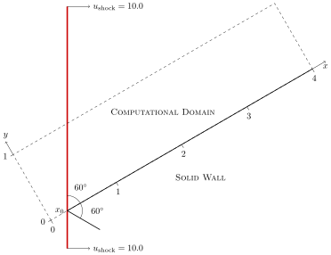

  <h1>A Novel Energy-based Artificial Viscosity for Suppressing Numerical Oscillations in Discontinuous Galerkin and Flux Reconstruction Schemes</h1>
  <h2>[Weicheng Pei](weicheng.pei@icloud.com) and [Yu-Xin Ren](ryx@tsinghua.edu.cn)</h2>
  <h3>Institute of Fluid Mechanics, Tsinghua University</h3>

# 1. Introduction

## 1.1. High-order schemes for unstructured grids

- FV (finite volume)
  - (compact) least squares by [Wang (2016)](https://doi.org/10.1016/j.jcp.2016.03.048)
  - variational reconstruction [Wang (2017)](https://doi.org/10.1016/j.jcp.2017.02.031)
- DG (discontinuous Galerkin)
  - modal vs. nodal
  - Legendre vs. Lobatto
- FR (flux reconstruction)

## 1.2. Shock capturing techniques for DG and FR

- Limiter
  - *simple compact WENO* by [Zhong (2013)](https://doi.org/10.1016/j.jcp.2012.08.028) and [Zhu (2013)](https://doi.org/10.1016/j.jcp.2013.04.012)<a href name="simple-weno" />
  - *$$p$$-weighted* by [Li (2020)](https://doi.org/10.1016/j.jcp.2020.109246)
  - *multi-resolution WENO* by [Zhu (2023)](https://doi.org/10.1007/s42967-023-00272-y)
- Filter
  - *entropy-based* by [Dzanic (2022)](https://doi.org/10.1016/j.jcp.2022.111501)
- Artificial Viscosity
  - *decay-rate-based* by [Persson (2006)](https://doi.org/10.2514/6.2006-112)
    - improved by [Klöckner (2011)](https://doi.org/10.1051/mmnp/20116303)

## 1.3. Key points of the proposed artificial viscosity

### Targets

- For both DG and FR schemes.
- For both modal and nodal versions.
- No modal proxy and extrapolation for nodal versions.
- Easy for implementation and vectorization.

### Procedures

1. Add a quasi***linear*** viscous term, and choose a ***linear*** scheme for viscous flux.
1. Derive the semi-discretized ODE system, which is *linear* in viscosity.
1. Factor out the ***dissipation matrix***, which is constant for static elements.
1. Precompute and cache the *dissipation matrix* for each element.
1. At the beginning of each time step:
   1. Compute the energy ***dissipation rate*** for each element.
   1. Evaluate the ***oscillation energy*** for each element.
   1. Get the artificial viscosity from the ratio of them (for each component).
   1. Reconstruct the viscosity distribution (optional).

# 2. Methods

## 2.1. DG and FR — a quick review and some remarks

### 2.1.1. Element-wise polynomial approximations

To solve a 2d conservation law (system)

$$
\partial_{t}\,u+\partial_{\vec{r}}\vdot\vec{f}=0,\quad\partial_{\vec{r}}\vdot\vec{f}=\partial_{x}\,f^{x}+\partial_{y}\,f^{y},
$$

one first introduce a coordiante map

$$
\underbrace{(x,y)}_{\vec{r}}\mapsto\underbrace{(\xi,\eta)}_{\vec{\rho}}
\implies
\begin{bmatrix}\partial_{\xi}\,\phi\\
\partial_{\eta}\,\phi
\end{bmatrix}=\underbrace{\begin{bmatrix}\partial_{\xi}\,x & \partial_{\xi}\,y\\
\partial_{\eta}\,x & \partial_{\eta}\,y
\end{bmatrix}}_{\underline{J}}\begin{bmatrix}\partial_{x}\,\phi\\
\partial_{y}\,\phi
\end{bmatrix}=\begin{bmatrix}\partial_{\xi}\,\vec{r}\\
\partial_{\eta}\,\vec{r}
\end{bmatrix}\vdot\partial_{\vec{r}}\,\phi,
$$

in which

$$
U=u\,\underbrace{\det(\underline{J})}_{J},\quad\begin{bmatrix}F^{\xi}\\
F^{\eta}
\end{bmatrix}=J\,\underbrace{\begin{bmatrix}\partial_{x}\,\xi & \partial_{y}\,\xi\\
\partial_{x}\,\eta & \partial_{y}\,\eta
\end{bmatrix}}_{\underline{J}^{-1}}\begin{bmatrix}f^{x}\\
f^{y}
\end{bmatrix}=J\begin{bmatrix}\partial_{\vec{r}}\,\xi\\
\partial_{\vec{r}}\,\eta
\end{bmatrix}\vdot\vec{f}.
$$

Then, one might use either an orthonormal (modal) expansion or a Lagrange (nodal) interpolation for either $$u$$ or $$U\equiv Ju$$ on the $$j$$th element:

$$
u(\vec{r},t)\approx u_{j}^{h}(\vec{r},t)=\begin{cases}
\sum_{n=1}^{N}\hat{u}_{j,n}(t)\,\phi_{j,n}(\vec{\rho}), & \text{Lagrange interpolation},\\
\sum_{m=1}^{M}\tilde{u}_{j,m}(t)\,\psi_{j,m}(\vec{r}), & \text{orthonormal expansion},
\end{cases}
$$

### 2.1.2. Semi-discretized systems from DG and FR

A DG scheme might be formulated either in physical coordinates

$$
\int_{E_j}\phi_n\pdv{u_j^h}{t}
=\int_{E_j}\vec{f}_j^D\vdot\grad\phi_n
-\oint_{\partial E_j}f^{I}\,\phi_n,\quad \forall n\in\{1,\dots,N\},
$$

or in parametric coordinates

$$
\int_{\mathcal{E}_j}\phi_{n}\pdv{U_j^{h}}{t}=\int_{\mathcal{E}_j}\vec{F}_j^{D}\vdot\grad\phi_{n}-\oint_{\partial\mathcal{E}_j}F^{I}\,\phi_{n},\quad\forall n\in\{1,\dots,N\},
$$

A FR scheme is usually given in parametric coordinates

$$
\begin{aligned}\dv{\hat{U}_{j,m,n}}{t} & =\frac{\partial F_{j}^{\xi,D}(\xi_{m},\eta_{n})}{\partial\xi}+\sum_{a=\pm1}\left[F^{I}-F_{j}^{\xi,D}\right]_{\xi=a,\eta_{n}}\dv{g_{a}(\xi_{m})}{\xi}\\
 & +\frac{\partial F_{j}^{\eta,D}(\xi_{m},\eta_{n})}{\partial\eta}+\sum_{b=\pm1}\left[F^{I}-F_{j}^{\eta,D}\right]_{\xi_{m},\eta=b}\dv{g_{b}(\eta_{n})}{\eta},
\end{aligned}
$$

in which $$g$$'s are correction functions satisfying

$$
g_{+1}(+1)=1,\quad
g_{+1}(-1)=0,\quad
g_{-1}(-\xi)=g_{+1}(+\xi),\quad \forall\xi\in[-1,1],
$$

and look like

| Typical Correction Functions |
| :--------------------------: |
|    |

The original flux (disconstinuous on element interfaces) is reconstructed to be $$ C_0 $$ constinuous in global:

| Flux Reconstruction Demo |
| :--------------------------: |
|   |

Some choices of $g$ lead to the equivalent DG schemes:

| Equivalence between DG and FR |
| :--------------------------: |
|   |

### 2.1.3. Direct viscous fluxes on element interfaces

Common fluxes on element interfaces:

- Convection: exact or approximate Riemann solvers.
- Diffusion: BR1/BR2, LDG (local DG), ***DDG (direction DG)***, ...

In this work, we use the last one (DDG):

$$
\begin{bmatrix}\partial_{x}\,u\\
\partial_{y}\,u
\end{bmatrix}_{\partial E}=\beta_{0}\,\Delta^{-1}\begin{bmatrix}n_{x}\,u\\
n_{y}\,u
\end{bmatrix}_{\mathrm{R}-\mathrm{L}}+\begin{bmatrix}\partial_{x}\,u\\
\partial_{y}\,u
\end{bmatrix}_{(\mathrm{R}+\mathrm{L})/2}+\beta_{1}\,\Delta
\begin{bmatrix}
n_x\,\partial^2_{xx}\,u + n_y\,\partial^2_{xy}\,u\\
n_x\,\partial^2_{yx}\,u + n_y\,\partial^2_{yy}\,u
\end{bmatrix}_{\mathrm{R}-\mathrm{L}},
$$

⚠️ Physical derivatives from interpolations in parametric coordinates might be costly and error-prone.

If, the interpolation is applied to $u$, the second-order derivatives are

$$
\begin{aligned}\begin{bmatrix}\partial_{xx}^{2}\,u & \partial_{xy}^{2}\,u\\
\partial_{yx}^{2}\,u & \partial_{yy}^{2}\,u
\end{bmatrix} & =\underbrace{\underline{J}^{-1}\begin{bmatrix}\partial_{\xi}\\
\partial_{\eta}
\end{bmatrix}}_{\begin{bmatrix}\partial_{x}\\
\partial_{y}
\end{bmatrix}}\underbrace{\left(\mathinner{\begin{bmatrix}\partial_{\xi}\,u & \partial_{\eta}\,u\end{bmatrix}}\underline{J}^{-T}\right)}_{\begin{bmatrix}\partial_{x}\,u & \partial_{y}\,u\end{bmatrix}}\\
 & =\underline{J}^{-1}\mathinner{\begin{bmatrix}\partial_{\xi}\mathinner{\begin{bmatrix}\partial_{\xi}\,u & \partial_{\eta}\,u\end{bmatrix}}\\
\partial_{\eta}\mathinner{\begin{bmatrix}\partial_{\xi}\,u & \partial_{\eta}\,u\end{bmatrix}}
\end{bmatrix}}\underline{J}^{-T}+\underline{J}^{-1}\begin{bmatrix}\mathinner{\begin{bmatrix}\partial_{\xi}\,u & \partial_{\eta}\,u\end{bmatrix}}\partial_{\xi}\,\underline{J}^{-T}\\
\mathinner{\begin{bmatrix}\partial_{\xi}\,u & \partial_{\eta}\,u\end{bmatrix}}\partial_{\eta}\,\underline{J}^{-T}
\end{bmatrix},
\end{aligned}
$$

in which the derivatives of the Jacobian matrix

$$
\pdv{\underline{J}^{-T}}{\xi}=\left(-\underline{J}^{-1}\,\pdv{\underline{J}}{\xi}\,\underline{J}^{-1}\right)^{T},\quad
\pdv{\underline{J}^{-T}}{\eta}=\left(-\underline{J}^{-1}\,\pdv{\underline{J}}{\eta}\,\underline{J}^{-1}\right)^{T},
$$

should be precomputed and cached on each flux point.

If the interpolation is applied to $U\equiv Ju$, the second-order derivatives are more complex:

$$
\begin{aligned}\begin{bmatrix}\partial^2_{xx}\,u & \partial^2_{xy}\,u\\
\partial^2_{yx}\,u & \partial^2_{yy}\,u
\end{bmatrix} & =\underbrace{\underline{J}^{-1}\begin{bmatrix}\partial_{\xi}\\
\partial_{\eta}
\end{bmatrix}}_{\begin{bmatrix}\partial_{x}\\
\partial_{y}
\end{bmatrix}}\underbrace{\left(\mathinner{\begin{bmatrix}\partial_{\xi}\,U & \partial_{\eta}\,U\end{bmatrix}}\underline{J}^{-T}\,J^{-1}-\mathinner{\begin{bmatrix}\partial_{\xi}\,J & \partial_{\eta}\,J\end{bmatrix}}\underline{J}^{-T}\,J^{-2}\,U\right)}_{\begin{bmatrix}\partial_{x}\,u & \partial_{y}\,u\end{bmatrix}}\\
 & =\underline{J}^{-1}\mathinner{\begin{bmatrix}\partial_{\xi}\,\partial_{\xi}\,U & \partial_{\xi}\,\partial_{\eta}\,U\\
\partial_{\eta}\,\partial_{\xi}\,U & \partial_{\eta}\,\partial_{\eta}\,U
\end{bmatrix}}\underline{J}^{-T}\,J^{-1}+\cdots,
\end{aligned}
$$

$$
\begin{aligned}\partial_{\xi}\left(\mathinner{\begin{bmatrix}\partial_{\xi}\,U & \partial_{\eta}\,U\end{bmatrix}}\underline{J}^{-T}\,J^{-1}\right) & =\mathinner{\begin{bmatrix}\partial_{\xi}\,\partial_{\xi}\,U & \partial_{\xi}\,\partial_{\eta}\,U\end{bmatrix}}\underline{J}^{-T}\,J^{-1}\\
 & +\mathinner{\begin{bmatrix}\partial_{\xi}\,U & \partial_{\eta}\,U\end{bmatrix}}\left(\pdv{\underline{J}^{-T}}{\xi}\,J^{-1}+\underline{J}^{-T}\left(\partial_{\xi}\,J^{-1}\right)\right),
\end{aligned}
$$

$$
\begin{aligned}\partial_{\xi}\left(\mathinner{\begin{bmatrix}\partial_{\xi}\,J & \partial_{\eta}\,J\end{bmatrix}}\underline{J}^{-T}\,J^{-2}\,U\right) & =\mathinner{\begin{bmatrix}\partial_{\xi}\,\partial_{\xi}\,J & \partial_{\xi}\,\partial_{\eta}\,J\end{bmatrix}}\underline{J}^{-T}\,J^{-2}\,U\\
 & +\mathinner{\begin{bmatrix}\partial_{\xi}\,J & \partial_{\eta}\,J\end{bmatrix}}\left(\pdv{\underline{J}^{-T}}{\xi}\,J^{-2}\,U+\underline{J}^{-T}\,\pdv{J^{-2}}{\xi}\,U+\underline{J}^{-T}\,J^{-2}\,\pdv{U}{\xi}\right),
\end{aligned}
$$

in which, the derivatives of Jacobian determinant

$$
\pdv{J^{-1}}{\xi}=-J^{-2}\,\pdv{J}{\xi},\quad\pdv{J^{-2}}{\xi}=-2J^{-3}\,\pdv{J}{\xi},
$$

$$
\pdv{J}{\xi}=\pdv{\det(\underline{J})}{\xi}=\det(\underline{J})\tr(\underline{J}^{-1}\,\pdv{\underline{J}}{\xi})=J\tr(\underline{J}^{-1}\,\pdv{\underline{J}}{\xi}),
$$

should also be cached.

## 2.2. Artificial viscosity based on energy dissipation

### 2.2.1. Quasi-linear artificial viscosity

Take the scalar case in 1d space as an example:

$$
\pdv{u}{t}+\pdv{f(u)}{x}=\pdv{x}\qty({\color{red}\nu(u)}\pdv{u}{x}),\quad \nu(u) \ge 0.
$$

> Generalizing to systems:
>
> - For a one-dimensional system, the procedure could be applied to either each conservative variable or each characteristic variable.
>
> - For a multi-dimensional problem, we just apply the proposed procedure to each conservative variable, i.e.
>
> $$
> \pdv{t}\mqty[u_1\\ \vdots \\ u_K]+\grad\vdot\mqty[\vb*{f}_1\\ \vdots \\ \vb*{f}_K]
> =\grad\vdot\mqty[{\color{red}\nu_1(u)}\grad{u}_1\\ \vdots \\ {\color{red}\nu_K(u)}\grad{u}_K],
> $$
>
> Assume the viscosity value is a constant across the entire domain.

The semi-discretized ODE system can be written as

$$
\dv{t}\ket{\hat{u}_{j}}=(\text{inviscid terms})+\nu\left(\underline{D}_{jj}\ket{\hat{u}_{j}}+\sum_{j'}\underline{D}_{jj'}\ket{\hat{u}_{j'}}\right),
$$

Without loss of generality, we hereforth only consider the nodal interpolation in which solution points are also Gaussian quadrature points.

### 2.2.2. Dissipation rate of kinetic energy

One may now define the ***kinetic energy*** on $E_j$ to be

$$
\begin{aligned}
K_{j}\coloneqq\int_{E_{j}}\frac{1}{2}\qty(u_{j}^{h})^{2}
&\approx\frac{1}{2}\sum_{n=1}^{N}w_{j,n}\,\hat{u}_{j,n}\,\hat{u}_{j,n}
\\
&=\frac{1}{2}\underbrace{\begin{bmatrix}\hat{u}_{j,1} & \cdots & \hat{u}_{j,N}\end{bmatrix}}_{\bra{\hat{u}_{j}}}\underbrace{\begin{bmatrix}w_{j,1}\\
 & \ddots\\
 &  & w_{j,N}
\end{bmatrix}}_{\underline{W}_{j}}\underbrace{\begin{bmatrix}\hat{u}_{j,1}\\
\vdots\\
\hat{u}_{j,N}
\end{bmatrix}}_{\ket{\hat{u}_{j}}},
\end{aligned}
$$

The ***dissipation rate*** of $K_j$ can easily be derived, which is

$$
\begin{aligned}
\dv{K_j}{t}
&=\bra{\hat{u}_{j}}\underline{W}_{j}\dv{t}\ket{\hat{u}_{j}}
\\
&=(\text{inviscid terms})+\nu\,\underbrace{\bra{\hat{u}_{j}}\underline{W}_{j}\,\underline{D}_{jj}\ket{\hat{u}_{j}}}_{G_j}+(\text{inter-cell viscous terms}),
\end{aligned}
$$

By ignoring the inviscid terms and inter-cell viscous terms, one gets

$$
\nu_{j}=\frac{\Delta K_{j}}{-G_{j}\,\tau_j}
\impliedby\dv{t}K_{j}=\cdots+\nu\,G_{j}+\cdots,
$$

in which

$$
\tau_j = C \frac{h_j}{\lambda_\max},
$$

$$C$$ is the only tuneable parameter.

⚠️ To avoid extremely large viscosity:

$$
\nu_{j}=\min\qty(\frac{-\Delta K_{j}}{G_{j}\cdot\tau_j},\lambda_\max\frac{h_j}{P}),
$$

⚠️ To avoid 0-in-divisor:

| Large $$\nu$$ caused by $$0$$-in-divisor |
| :--------------------------: |
|   |

$$
u^h_j\in \mathbb{P}_{P}(E_j),\quad \forall j,
$$

$$
\implies
\abs{u^h_{j}-u^h_{j'}}
\approx\abs{u^\mathrm{ref}_j}\cdot
\begin{cases}
\order{h^{P+1}},&\text{smooth},\\
\order{1},&\text{jump},
\end{cases}
$$

$$
\implies\oint_{\partial E_j}\abs{u^h_{j}-u^h_{j'}}^2\cdot h
\approx\abs{u^h_{j}-u^h_{j'}}^2\cdot\underbrace{\abs{\partial E_j}\cdot h}_{h^{D}}
\approx\abs{u^\mathrm{ref}_j}\cdot
\begin{cases}
\order{h^{2P+2+D}},&\text{smooth},\\
\order{h^{D}},&\text{jump},
\end{cases}
$$

$$
\implies
\frac{\oint_{\partial E_j}\abs{u^h_{j}-u^h_{j'}}^2\cdot h}{\abs{u^\mathrm{ref}_j}^2\cdot h^{P+1}\cdot h^D}
\approx
\begin{cases}
\order{h^{+P+1}}\ll1,&\text{smooth},\\
\order{h^{-P-1}}\gg1,&\text{jump},
\end{cases}
$$

### 2.2.3. Oscillation energy estimations

The last question is how to evaluate the ***oscillation energy*** $\Delta K_j$, which quantitatively measures the numerical oscillation on $E_j$.

In one-dimensional cases, we define it to be

$$
\Delta K_j = \int_{x_{j-1/2}}^{x_{j}}\left(u_{j}^{h}-u_{j-1}^{h}\right)^{2}\dd{x}+\int_{x_{j}}^{x_{j+1/2}}\left(u_{j}^{h}-u_{j+1}^{h}\right)^{2}\dd{x},
$$

Both the *integrals* and *extrapolations* are cheap.

However, when it is generalized to *multi-dimensional* cases, one has to (iteratively) solve

$$
\mqty[x \\ y]_\text{query} = \mqty[x^h(\xi, \eta) \\ y^h(\xi, \eta)],
$$

for the value of $(\xi,\eta)$ from the given $(x,y)$ on a neighboring cell.

Even worse, the solution of this equation might not exist:

| Failed Coordinate Map |
| :-------------------: |
|    |

In the current work, we use the following surface integral of value jumps

$$
\oint_{\partial E_j} \qty(u^h_{j}-u^h_{j'})^2,\quad
j'\in\text{ neighbors of } E_j,
$$

which is a simplified case of the one used in variational reconstruction.

Further tests on more challenging problems are still in progress.

It is an open problem to design an oscillation measure requiring no extrapolations.

# 3. Results

Common settings:
- Correction function: $$ g_2 $$ in [Huynh (2007)](https://doi.org/10.2514/6.2007-4079)
- Temporal integration: TVD/SSP RK3 in [Gottlieb (2001)](https://doi.org/10.1137/s003614450036757x)

## 3.1. One-dimensional problems

Additional common settings:
- Number of elements: $$ N_\text{cell} = 100 $$
- Degree of element-wise polynomials: $$ P = 4 $$

### 3.1.1. Sod's shock tube problem

$$
\mqty[\rho & u & p]_{t=0}
=
\begin{cases}
\mqty[1 & 0 & 1], &x<0,\\
\mqty[0.125 & 0 & 0.1], &x>0,\\
\end{cases}
$$

| Density | Viscosity |
|:-------:|:----:|
|  |  |

### 3.1.2. Lax's shock tube problem

$$
\mqty[\rho & u & p]_{t=0}
=
\begin{cases}
\mqty[0.445 & 0.698 & 3.528], &x<0,\\
\mqty[0.5 & 0 & 0.571], &x>0,\\
\end{cases}
$$

| Density | Viscosity |
|:-------:|:----:|
|  |  |

### 3.1.3. The Shu–Osher problem

Proposed by [Shu (1989)](https://doi.org/10.1016/0021-9991(89)90222-2)

$$
\mqty[\rho & u & p]_{t=0}
=
\begin{cases}
\mqty[3.857143 & 2.629369 & 10.33333], &x\in[0,1);\\
\mqty[1+0.2\sin(5x) & 0 & 1], &x\in(1,10].
\end{cases}
$$

| Density | Viscosity |
|:-------:|:----:|
|  |  |

## 3.2. Multi-dimensional problems

### 3.2.0. Sod's shock tube problem in 3d

|             |                $$P=2$$                |                $$P=3$$                |
| :---------: | :-----------------------------------: | :-----------------------------------: |
| $$N_x=25$$  |  |  |
| $$N_x=100$$ |  |  |

### 3.2.1. A Two-dimensional Riemann problem

[Lax (1997)](https://doi.org/10.1137/s1064827595291819) defines dozens of 2D Riemann problems.

The one we solve is

$$
\begin{bmatrix}\rho & u & v & p\end{bmatrix}=\begin{cases}
\begin{bmatrix}1.5 & 0 & 0 & 1.5\end{bmatrix}, & (x,y)\in(0.8,1)\times(0.8,1),\\
\begin{bmatrix}0.5323 & 1.206 & 0 & 0.3\end{bmatrix}, & (x,y)\in(0,0.8)\times(0.8,1),\\
\begin{bmatrix}0.138 & 1.206 & 1.206 & 0.029\end{bmatrix}, & (x,y)\in(0,0.8)\times(0,0.8),\\
\begin{bmatrix}0.5323 & 0 & 1.206 & 0.3\end{bmatrix}, & (x,y)\in(0.8,1)\times(0,0.8),
\end{cases}
$$

Two shocks interfere with each other:
- one runs to the left
- the other runs to the bottom

|  | $$P=2$$ | $$P=3$$ |
| :------------: | :--------: | :--------: |
| $$h=0.05$$ |  |  |
| $$h=0.01$$ |  |  |

### 3.2.2. The Double Mach Reflection problem

Proposed by [Woodward (1984)](https://doi.org/10.1016/0021-9991(84)90142-6)

| Sketch of the Double Mach Reflection Problem |
| :-------------------: |
|    |

$$h\approx 0.02$$, $$P=2$$ with the [simple compact WENO limiter](#simple-weno):

|      Reference Solution Given by Limiter      |
| :-------------------------------------------: |
|  |

$$h\approx 0.05$$ by the proposed artificial viscosity:

| $$P$$ | Value | $$t=0.8$$ |
| :---: | :------------: | :--------: |
| 2 | $$\rho(t=0.25)$$ |  |
| 3 | $$\rho(t=0.25)$$ |  |
| 3 | $$\nu$$ for $$\rho(t=0.25)$$ |  |
| 3 | $$\nu$$ for $$\rho v(t=0.25)$$ |  |
| 3 | $$\rho v(t=0.25)$$ |  |

# Conclusions

The proposed artificial viscosity

- passes standard cases for testing shock capturing methods.
- succeeds in suppressing numerical oscillations near physical discontinuities.
- maintains the high-order accuracy of the DG or FR solution in smooth regions.

Further improvements might include

- more accurate estimation of the oscillation energy.
- more smooth distribution of the artificial viscosity.
- incorporating positivity-preserving mechanisms.
